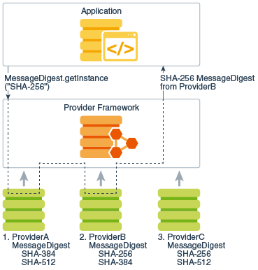
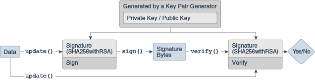

# 1. OAuth2.0 Resource Server

- 클리아언트 서버 및 인가서버와의 통신을 담당
- 클라이언트의 접근을 제한하는 인가 정책 설정
- 인가 서버에서 발급한 Access-Token의 유효성 검증 및 접근 범위(scope)에 따라 적절한 자원 전달

***
### JWT

- JWT 로 전달되는 토큰을 검증하기 위한 JwtDecoder, BearerTokenAuthenticationFilter, JwtAuthenticationProvider 클래스 제공
- JWT 자체 검증 프로세스 지원

***
### Opaque
- 인가서버의 introspection 엔드 포인트로 검증할 수 있는 Opaque 토큰 지원
- 실시간으로 토큰 활성화 여부 확인

***
### 자동설정 초기화 과정

- OAuth2ResourceServerAutoConfiguration
  - import 
    1. OAuth2ResourceServerProperties
    2. Oauth2ResourceServerConfiguration.JwtConfiguration
    3. Oauth2ResourceServerConfiguration.OpaqueTokenConfiguration

```java
@AutoConfiguration(before = { SecurityAutoConfiguration.class, UserDetailsServiceAutoConfiguration.class })
@EnableConfigurationProperties(OAuth2ResourceServerProperties.class)
@ConditionalOnClass(BearerTokenAuthenticationToken.class)
@ConditionalOnWebApplication(type = ConditionalOnWebApplication.Type.SERVLET)
@Import({ Oauth2ResourceServerConfiguration.JwtConfiguration.class,
		Oauth2ResourceServerConfiguration.OpaqueTokenConfiguration.class })
public class OAuth2ResourceServerAutoConfiguration {

}

```

***
- OAuth2ResourceServerProperties
  - application.yml 의 prefix 값 읽어서 세팅

```java
@ConfigurationProperties(prefix = "spring.security.oauth2.resourceserver")
public class OAuth2ResourceServerProperties {

  private final Jwt jwt = new Jwt();
  private final Opaquetoken opaqueToken = new Opaquetoken();
  
  //...(중략)
}
```

***
- Oauth2ResourceServerConfiguration
  - Jwt 설정 클래스 import
  - Opaque 설정 클래스 import

```java
class Oauth2ResourceServerConfiguration {

	@Configuration(proxyBeanMethods = false)
	@ConditionalOnClass(JwtDecoder.class)
	@Import({ OAuth2ResourceServerJwtConfiguration.JwtDecoderConfiguration.class,
			OAuth2ResourceServerJwtConfiguration.OAuth2SecurityFilterChainConfiguration.class })
	static class JwtConfiguration {

	}

	@Configuration(proxyBeanMethods = false)
	@Import({ OAuth2ResourceServerOpaqueTokenConfiguration.OpaqueTokenIntrospectionClientConfiguration.class,
			OAuth2ResourceServerOpaqueTokenConfiguration.OAuth2SecurityFilterChainConfiguration.class })
	static class OpaqueTokenConfiguration {

	}

}

```

# 2. OAuth 2.0 Jwt 검증

- application.yml 에 설정된 issuer-uri, jwt-set-uri 를 통해 JwkSet 정보 요청
- 응답 받은 JwkSet 값을 토대로 Jwt 토큰 검증 수행
- Authentication.principal 에 검증 받은 Jwt 저장

# 3. JCA(Java Cryptography Architecture) & JCE(Java Cryptography Extension)

- 전자서명, 메세지 다이제스트, 인증서와 인증서 유효성 검사, 키 생성 및 관리 등 암호기술 제공
- 프로바이더 보안 구조를 사용
- 프로바이더는 java.security.Provider 클래스의 구현체로 보안 알고리즘 구현체 목록을 포함
- 프로바이더 목록 ( jre/lib/security/java.security )
  > security.provider.1=sun.security.provider.Sun
  > security.provider.2=sun.security.rsa.SunRsaSign
  > security.provider.3=com.sun.net.ssl.internal.ssl.Provider
  > security.provider.4=com.sun.crypto.provider.SunJCE
  > security.provider.5=sun.security.jgss.SunProvider
  > security.provider.6=com.sun.security.sasl.Provider
  > security.provider.7=org.jcp.xml.dsig.internal.dom.XMLDSigRI
  > security.provider.8=sun.security.smartcardio.SunPCSC
  > security.provider.9=sun.security.mscapi.SunMSCAPI
  ```
  MessageDigest.getInstance("SHA-256");
  ```

  

***
### MessageDigest

- 메세지 다이제스트의 목적은 원본 파일이 그대로인지 파악하는 무결성 검사
- 단방향 알고리즘으로 복호화 불가능
- 원본 Message > Hash > MessageDigest 형태로 변환
- 무결성 검사 방식은 같은 MessageDigest 로 변환 됬을 경우 검증 통과

***
### Signature



- Signature는 초기화 시 제공받은 키를 사용해서 서명 및 서명의 유효성을 검증
- 개인 키로 서명, 서명할 원본 데이터 제공 
- 검증은 개인 키와 쌍을 이루는 공개 키로 이루어 지며 해당 공개 키를 제공


***
### 대칭키 알고리즘

- 암복호화에 같은 암호키를 사용하는 알고리즘
- 비대칭키 암호와 비교하여 계산 속도가 빠름
- MAC(Message Authentication Code)
  - 메세지 다이제스트와 비슷하지만 Secret Key(대칭키) 가 필요하다는 점에서 다름
  - MAC는 동일한 대칭키를 가진 쪽에서만 무결성 검사 가능

***
### 비대칭키 알고리즘

- 암호화 시 PrivateKey, 복호화 시 PublicKey 로 다른 암호키를 쓰는 알고리즘
- 비밀 키 암호화는 공개 키로 복호화 가능
- 공개 키 암호화는 비밀 키로 복호화 가능
- RSA
  - 현재 SSL/TLS에 가장 많이 사용되는 암호화 알고리즘
  - 전 세계 대부분의 인터넷 뱅킹이 RSA-2048 암호화 사용

# 4. JWT - JOSE(JSON Object Signing and Encryption) 

- JSON 데이터의 컨텐츠를 암호화 또는 서명의 형태로 나타내기 위해 IETF에서 표준화

1. JWT (JSON Web Token)
  - 클레임 기반 보안 값을 나타내는 방법
  - JWS 또는 JWE 방식으로 구현
  - 대부분 JWS 로 구현 되고 있음

2. JWS (JSON Web Signature)
  - JSON 을 사용하여 디지털 서명 또는 MAC 으로 보안된 컨텐츠를 표현

3. JWE (JSON Web Encryption)
  - JSON 을 사용하여 암호화된 토큰을 표현

4. JWK (JSON Web Key)
  - HMAC 또는 RSA 알고리즘을 사용하여 공개 키 세트를 JSON 객체로 나타내는 구조

5. JWA (JSON Web Algorithm)
  - JWK, JWK, JWE 에 필요한 알고리즘 목록
  - JWS 헤더 및 JWS 페이로드의 내용을 서명하는데 사용

***
### JWT 구조

1. Header
   - 알고리즘 타입, 토큰 타입 정보로 구성
   - Base64로 인코딩 되어서 JWT 첫 번째 부분에 위치
     ```json
     {
       "alg": "HS256", // 서명 알고리즘 지정, 필수
       "typ": "JWT" // 토큰 타입 지정
     }
     ```
2. Payload
  - 토큰에 포함할 내용인 클레임으로 구성
  - 7개의 표준 필드 및 사용자 지정 클레임으로 구성
    ```json
    {
      "sub": "1234567890",
      "name": "John Doe",
      "admin": true
    }
    ```
    
3. Signature
  - 서명 알고리즘 값+헤더+'.'+페이로드를 인코딩 해서 구성
    ```
    HMAC-SHA256(
      secret,
      base64urlEncoding(header) + '.' +
      base64urlEncoding(payload)
    )
    ```
    
